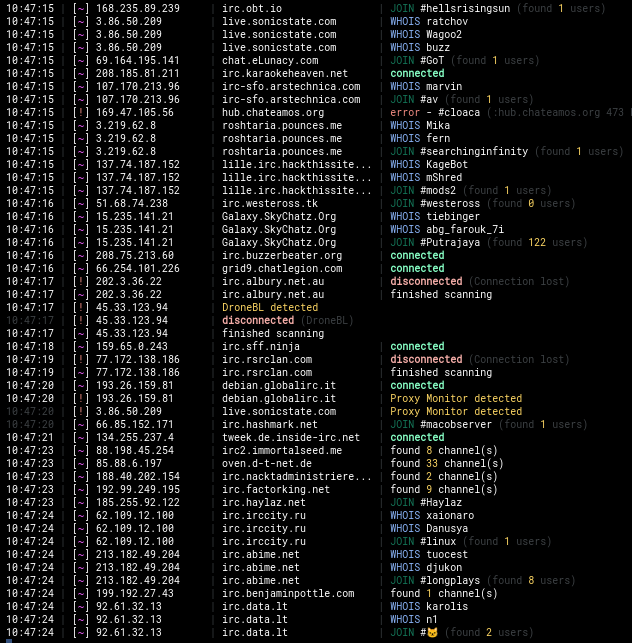

# Internet Relay Chat Probe (IRCP)

*TRIPLE 6 SEVEN OCULOUS*

A robust information gathering tool for large scale reconnaissance on [Internet Relay Chat](https://en.wikipedia.org/wiki/Internet_Relay_Chat) servers, made for future usage with [internetrelaychat.org](https://internetrelaychat.org) for public statistics on the protocol.

Meant to be used in combination with [masscan](https://github.com/robertdavidgraham/masscan) checking **0.0.0.0/0** *(the entire IPv4 range)* for ports **6660-6669**, **6697**, **7000**, & other common IRC ports.

The idea is to create a *proof-of-concept* documenting how large-scale information gathering on the IRC protocol can be malicious & invasive to privacy, while also yielding deep-dive look at the IRC protocol & it's internal statistics & commonalities.

## Usage
The only required arguement to pass is a direct path to the targets list, which should be a text file containing a new-line seperated list of targets. Targets must be a valid IPv4 or IPv6 address & can optionally be suffixed with a port.

Edit [ircp.py](https://github.com/internet-relay-chat/IRCP/blob/master/ircp.py) & tweak the settings to your favor, though they rest with sane defaults.

## Order of Operations
First, an attempt to connect using SSL/TLS is made, which will fall back to a standard connection if it fails. If a non-standard port was given, both standatd & secure connection attempts are made on the port as-well. The **RPL_ISUPPORT** *(005)* response is checked for the `SSL=` option to try & locate secure ports.

Once connected, server information is gathered from `ADMIN`, `CAP LS`, `MODULES -all`, `VERSION`, `IRCOPS`, `MAP`, `INFO`, `LINKS`, `STATS p`, & `LIST` replies. An attempt to register a nickname is then made by trying to contact NickServ.

Lastly, every channel is joined with a `WHO` command sent & every new nick found gets a `WHOIS` sent.

Once we have finishing scanning a server, the information found is saved to a JSON file. The data in the logs are stored in categories based on [numerics](https://raw.githubusercontent.com/internet-relay-chat/random/master/numerics.txt) *(001 is RPL_WELCOME, 322 is RPL_LIST, etc)* & events *(JOIN, MODE, KILL, etc)*.

Everything is done in a *carefully* throttled manner for stealth to avoid detection. An extensive amount research on IRC daemons, services, & common practices used by network administrators was done & has fine tuned this project to be able to evade common triggers that thwart what we are doing.

## Preview

## Threat Scope
While IRC is an generally unfavored chat protocol as of 2023 *(roughly 7,000 networks)*, it still has a beating heart **(over 300,000 users & channels)* with potential for user growth & active development being done on [IRCv3](https://ircv3.net/) protocol implementations.

Point is..it's is not going anywhere. With that being said, every network being on the same port leads way for a lot of potential threats:

* A new RCE is found for a very common IRC bot
* A new 0day is found for a certain IRCd version
* Old IRC daemons running versions with known CVE's
* Tracing users network/channel whereabouts
* Mass spamming attacks on every network

Mass scanning *default* ports of services is nothing new & though port 6667 is not a common target, running an IRCd on a **non-standard** port should be the **standard**. If we have learned anything in the last 10 years, using standard ports for *anything* is almost always smells like a bad idea.

## Todo
* Built in identd
* Checking for IPv6 availability *(SSL= in 005 responses may help verify IPv6)*
* Support for IRC servers using old versions of SSL
* Create a seperate log for failed connections
* Ability to link multiple IRCP instances running in daemon mode together for balancing
* Remote syncing the logs to another server
* Give props to [bwall](https://github.com/bwall) for giving me the idea with his [ircsnapshot](https://github.com/bwall/ircsnapshot) repository
* Confirm nick registered *(most likely through MODE +r)* *(Log nick & password)*
* Support for hostnames in targets list *(Attempt IPv6 & fallback to IPv4)*

## Opt-out
The IRC networks we scanned are PUBLIC networks...any person can freely connect & parse the same information. Send your hate mail to [scan@internetrelaychat.org](mailto://scan@internetrelaychat.org)

## Mirrors
- [acid.vegas](https://git.acid.vegas/ircp)
- [GitHub](https://github.com/acidvegas/ircp)
- [GitLab](https://gitlab.com/acidvegas/ircp)
- [SuperNETs](https://git.supernets.org/acidvegas/ircp)